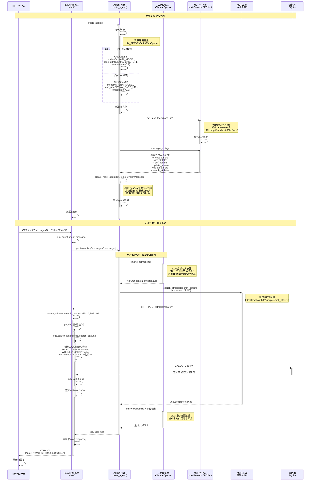

# AI助手/聊天调用流程图



## 关键组件说明

### 1. LLM提供商 (get_llm)
```python
# 环境变量配置
LLM_SERVE=OLLAMA  # 或 OPENAI
OLLAMA_BASE_URL=http://127.0.0.1:11434
OLLAMA_MODEL=qwen3:4b
OPENAI_BASE_URL=http://127.0.0.1:1234/v1
OPENAI_MODEL=gpt-3.5-turbo
```

### 2. MCP工具集成
- **协议**: Model Context Protocol (MCP)
- **传输**: streamable_http
- **URL**: http://localhost:8001/mcp/
- **服务名**: athletes

### 3. LangGraph React代理
- 使用预构建的 `create_react_agent`
- 思维链: Thought → Action → Observation
- 自动工具选择和调用
- 支持多轮对话

### 4. 数据流程
1. **用户输入** → 自然语言查询
2. **LLM分析** → 理解意图，提取参数
3. **工具调用** → 转换为结构化查询
4. **数据库查询** → 执行SQLAlchemy操作
5. **结果处理** → LLM格式化自然语言回复

### 5. 工具列表 (MCP)
| 工具名 | 功能 | 参数 |
|--------|------|------|
| create_athlete | 创建运动员 | AthleteCreate |
| get_athletes | 获取运动员列表 | skip, limit |
| get_athlete | 获取单个运动员 | athlete_id |
| update_athlete | 更新运动员 | athlete_id, AthleteUpdate |
| delete_athlete | 删除运动员 | athlete_id |
| search_athletes | 搜索运动员 | AthleteSearch, skip, limit |

### 6. 查询示例

**用户查询**: "找一个北京的运动员"

**解析过程**:
1. LLM识别意图: search
2. 提取参数: hometown="北京"
3. 调用工具: search_athletes({"hometown": "北京"})
4. 执行SQL: `WHERE hometown ILIKE '%北京%'`
5. LLM生成回复: "找到3位来自北京的运动员: ..."

**更复杂查询**: "找20岁以下，身高180以上的篮球运动员"
- 参数: min_age=20, max_age=inf, min_height=180, sport_event="篮球"
- 构建复合查询条件
