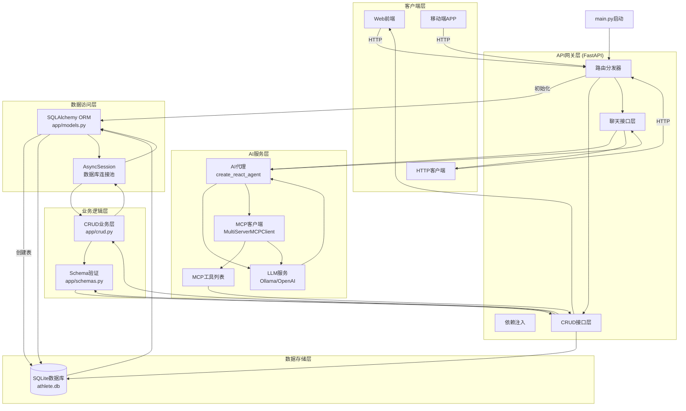
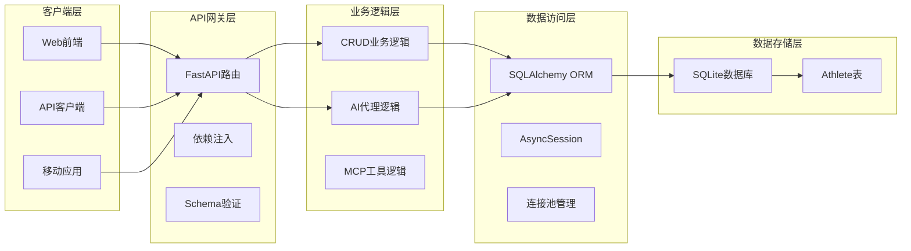
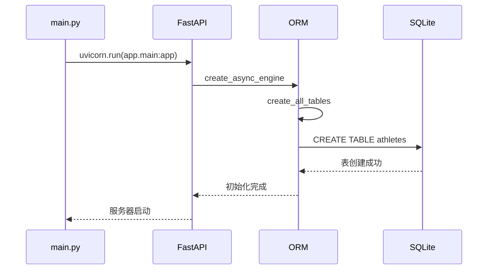
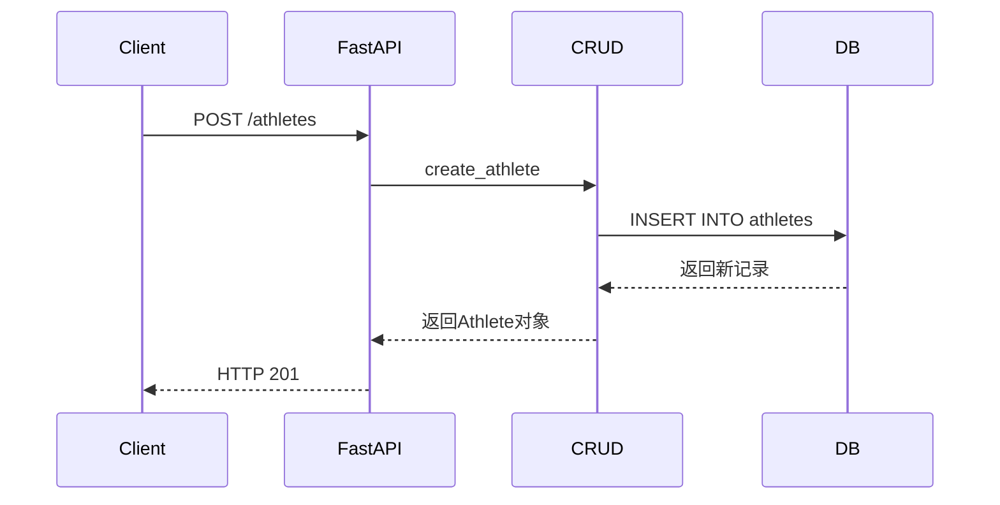
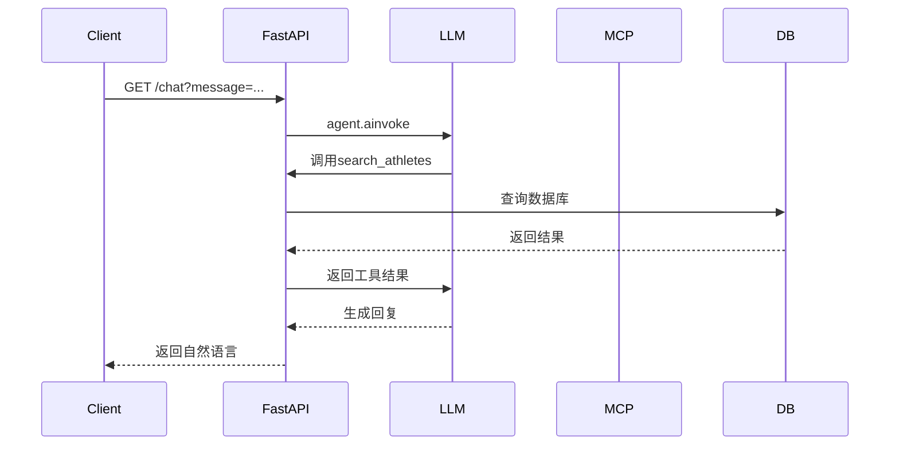

# 完整系统调用流程图

## 系统架构分层

## 核心调用流程详解

### 1. 系统启动流程

### 2. CRUD操作流程

### 3. AI聊天流程 (核心链路)

## 技术栈总览

| 层级 | 技术/框架 | 职责 |
|------|----------|------|
| 客户端层 | HTML/JS, HTTP客户端 | 用户交互 |
| API网关 | FastAPI | 路由分发, 请求处理 |
| 业务层 | Python | 业务逻辑 |
| AI服务 | LangChain, LangGraph | AI推理, 工具调用 |
| 数据访问 | SQLAlchemy | ORM映射 |
| 数据存储 | SQLite | 持久化存储 |

## 端口与服务

| 服务 | 端口 | 描述 |
|------|------|------|
| FastAPI服务器 | 8001 | 主API服务 |
| MCP端点 | 8001/mcp | 工具服务 |
| Ollama | 11434 | LLM服务 (可选) |
| OpenAI兼容 | 1234/v1 | LLM服务 (可选) |

## 关键特性

### 1. 软删除机制
- 所有DELETE操作标记而非物理删除
- 查询自动过滤 `is_deleted=false` 记录

### 2. AI智能查询
- 自然语言理解
- 自动工具选择
- 动态参数提取

### 3. 异步处理
- AsyncSQLAlchemy 异步数据库
- FastAPI 异步Web框架
- 非阻塞I/O操作

### 4. 模块化设计
- 清晰的层次分离
- 可插拔的LLM提供商
- 灵活的查询条件构建
