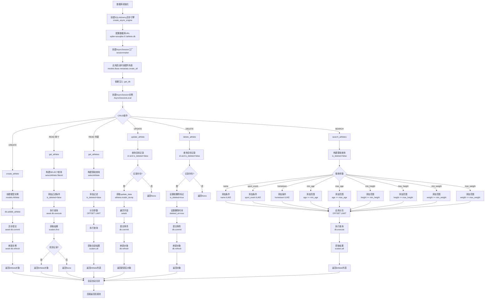
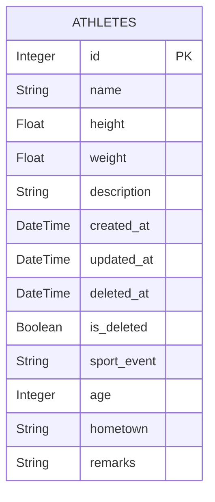

# 数据库操作流程图



## 数据库模型结构



## 数据库操作最佳实践

### 1. 异步会话管理
```python
async def get_db():
    async with AsyncSessionLocal() as db:
        yield db
```

### 2. 事务处理
- **CREATE/UPDATE/DELETE**: 必须调用 `await db.commit()`
- **READ**: 不需要提交
- **错误处理**: 异常自动回滚

### 3. 查询优化
- **过滤未删除记录**: 所有查询添加 `is_deleted=false`
- **索引字段**: id, name 已建索引
- **分页**: 使用 OFFSET/LIMIT

### 4. 软删除机制
```sql
-- 查询时自动过滤
SELECT * FROM athletes WHERE is_deleted = false;

-- 删除时标记
UPDATE athletes SET is_deleted = true WHERE id = ?;
```

### 5. 搜索特性
- **模糊匹配**: ilike 实现不区分大小写搜索
- **范围查询**: 支持 min/max 范围过滤
- **多字段**: 可同时在多个字段搜索
