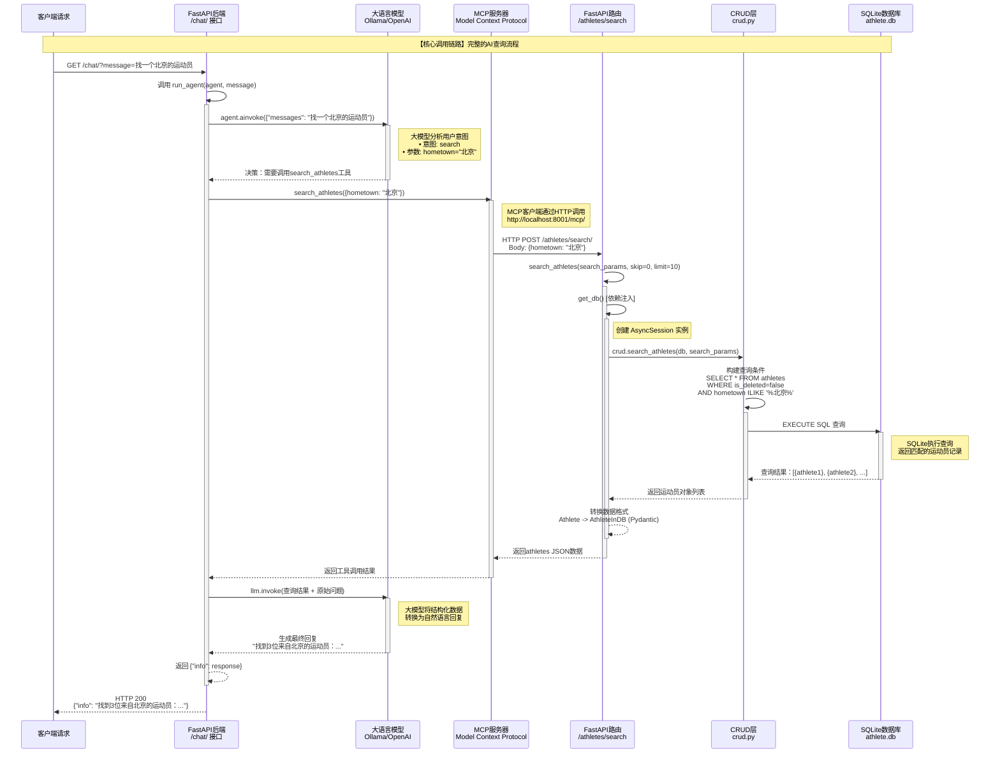

# 核心调用链路流程图：后端 → 大模型 → MCP → 数据库



## 调用链路总结

### 1️⃣ **后端 (FastAPI)**
- **入口**: `/chat/` 接口
- **职责**: 创建AI代理、接收请求、返回响应
- **关键方法**: `create_agent()`, `run_agent()`

### 2️⃣ **大语言模型 (LLM)**
- **提供商**: Ollama (默认) 或 OpenAI
- **职责**:
  - 理解用户自然语言意图
  - 提取结构化查询参数
  - 格式化最终回复
- **推理链**: 理解 → 决策 → 工具选择 → 结果解释

### 3️⃣ **MCP服务器 (Model Context Protocol)**
- **协议**: streamable_http
- **端点**: http://localhost:8001/mcp/
- **职责**:
  - 封装API工具为LLM可用工具
  - 处理工具调用和参数传递
  - 转换数据格式

### 4️⃣ **数据库 (SQLite)**
- **ORM**: AsyncSQLAlchemy
- **职责**:
  - 持久化运动员数据
  - 执行查询条件
  - 返回结构化结果

## 关键数据流向

```
用户自然语言
    ↓
"找一个北京的运动员"
    ↓
LLM解析意图
    ↓
hometown="北京" (结构化参数)
    ↓
MCP工具调用
    ↓
/athletes/search API
    ↓
SQLAlchemy查询构建
    ↓
SELECT * FROM athletes WHERE hometown ILIKE '%北京%'
    ↓
SQLite执行
    ↓
[运动员记录列表]
    ↓
LLM格式化
    ↓
"找到3位来自北京的运动员：1. 张三 - 篮球运动员..."
```

## 技术要点

### LLM配置
- **Ollama**: `qwen3:4b` @ `http://127.0.0.1:11434`
- **OpenAI**: `gpt-3.5-turbo` @ `http://127.0.0.1:1234/v1`

### MCP工具映射
| LLM工具名 | 对应API端点 | 参数 |
|-----------|-------------|------|
| create_athlete | POST /athletes/ | AthleteCreate |
| get_athletes | GET /athletes/ | skip, limit |
| get_athlete | GET /athletes/{id} | athlete_id |
| update_athlete | PUT /athletes/{id} | athlete_id, AthleteUpdate |
| delete_athlete | DELETE /athletes/{id} | athlete_id |
| search_athletes | POST /athletes/search/ | AthleteSearch |

### 查询优化
- **软删除**: 所有查询自动添加 `is_deleted=false`
- **分页**: 默认 limit=10，避免大结果集
- **索引**: id, name 字段已建立索引
