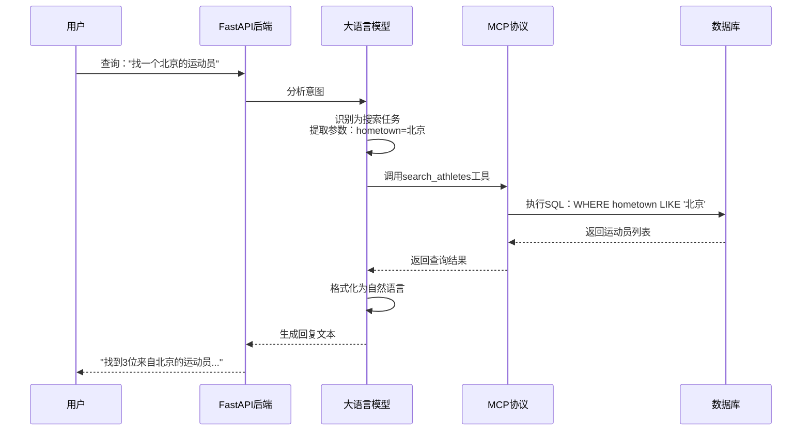
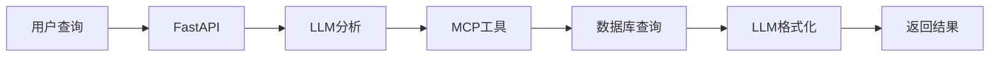

# 简化版核心调用链路流程图



## 更简洁的文字版流程

```
用户查询
    ↓
FastAPI /chat
    ↓
LLM理解意图
    ↓
MCP调用API
    ↓
SQLite查询
    ↓
LLM格式化
    ↓
返回结果
```

## 超简化版本



## 关键数据流

```
自然语言 → LLM解析 → 结构化查询 → SQL执行 → 结构化数据 → 自然语言回复
```

**示例**：
- 输入："找一个北京的运动员"
- 参数：`{hometown: "北京"}`
- SQL：`SELECT * FROM athletes WHERE hometown ILIKE '%北京%'`
- 输出："找到3位来自北京的运动员：1. 张三..."
