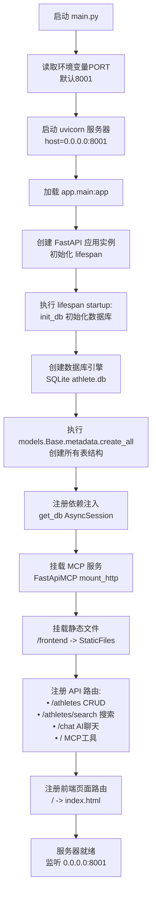

# 系统启动流程图

### 启动顺序说明

1. **入口点**: `main.py` 启动 uvicorn ASGI 服务器
2. **应用初始化**: 加载 `app.main:app` FastAPI 应用
3. **数据库初始化**: 创建 SQLite 连接，执行 ORM 模型创建
4. **MCP 服务**: 挂载 Model Context Protocol 服务（端口8001的/mcp端点）
5. **路由注册**: 注册运动员CRUD、搜索、AI聊天等接口
6. **静态资源**: 挂载前端静态文件目录

### 关键配置
- 端口: 8001（可配置）
- 数据库: SQLite (sqlite+aiosqlite:///./athlete.db)
- 静态目录: frontend/
- MCP端点: http://localhost:8001/mcp/
